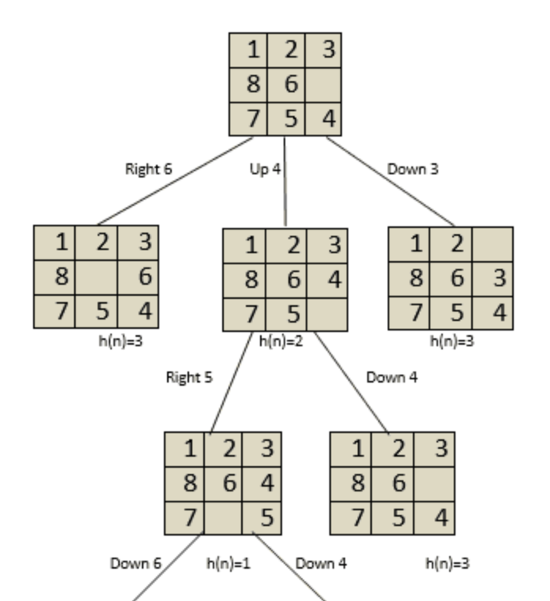
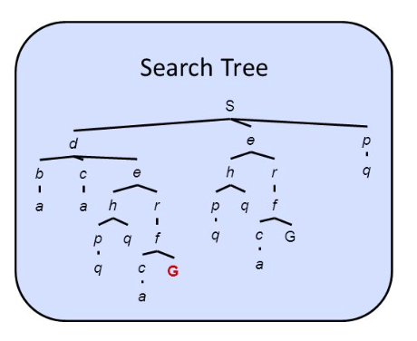
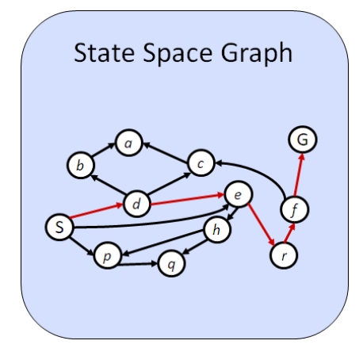
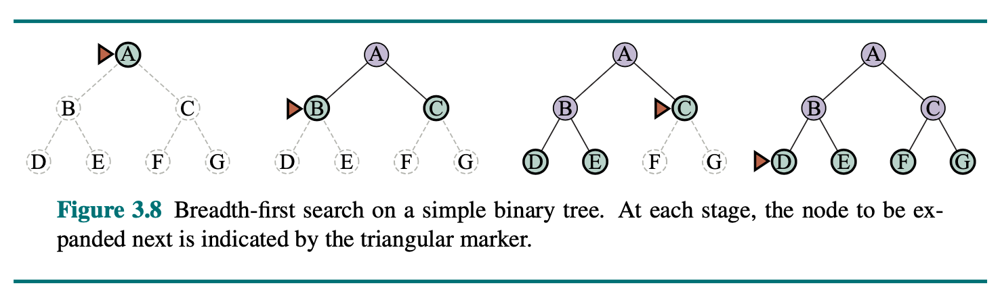
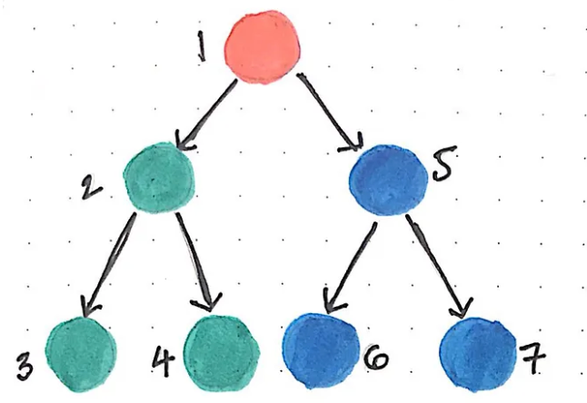

<!--
Week 3 Session A. Mini-lecture budget: 25 minutes.
Source: 02_Problem.pptx slides 1-10. Beats per lesson plan:
formulation (8) → graph vs. tree (7) → criteria (5) → algorithms (5).
Lesson plan: ../../weeks/week-03.md
-->

# Problem Solving

## Formulation, state spaces, and blind search

**CMP-4004** · Week 3

---

# Problem-solving agents

A **goal-based agent** that plans a sequence of actions to achieve its objective.

It runs in **search-then-execute** mode:

1. **Formulate** the problem — *what exactly is the problem?*
2. **Search** for a sequence of actions reaching the goal — *what is the best way?*
3. **Execute** the resulting plan

Assumes an **observable, deterministic, discrete, static** environment.

> The solution is always a **sequence** of actions, not a single action.

<!--
Connect back to week 2 explicitly: this is the goal-based agent from the
taxonomy, and those four assumptions are four of the six axes pinned to their
easy case. Every later week relaxes one of them.
-->

---

# Problem formulation — five components

| Component | Definition |
|---|---|
| **Initial state** | The state the agent starts from |
| **Actions** | The set of actions available in each state |
| **Transition model** | The result of applying an action: `Result(s, a) → s'` |
| **Goal test** | A condition determining whether a state is the goal |
| **Cost function** | Numerical cost of each action; **defines solution quality** |

Together these define the **state space**.

---

# Formulation is a design decision

## The 8-puzzle, two ways

| | "Move the tile" | "Move the blank" |
|---|---|---|
| Actions | 4 directions × 8 tiles | up/down/left/right on one blank |
| Branching factor | up to 32 nominal | **2–4** |
| Same puzzle? | yes | yes |
| Same search cost? | **no — wildly different** | |

> **Half of applied AI is choosing a good representation before you write any
> algorithm.**

<!--
8 min for formulation including this slide. Do the 8-puzzle and route-finding
side by side, then this comparison. This is the slide that earns Task 1 of the
studio, where students formulate missionaries-and-cannibals and disagree about
where to enforce constraints.
-->

---

# State space

The set of all states reachable from the initial state through **any** sequence
of actions.

Represented as a **graph**:

- **Nodes** are states of the world
- **Edges** are actions that transition between states
- Each edge has an associated **cost**

**It is never built explicitly** — in practice it is far too large. The agent
explores it progressively during the search.

---

# State *graph* vs. search *tree*

| **State graph** | **Search tree** |
|---|---|
| Represents the **problem** | Represents the **search process** |
| Each state appears **once** | The same state may appear **many times**, once per path reaching it |
| Finite (if the space is finite) | **Can be infinite even when the graph is finite** |

A graph with a cycle produces an infinite tree. Expanding it three levels by hand
makes this obvious in a way the sentence does not.

---

# Repeated states will not terminate on their own

When the search tree is expanded, the same state may be generated through
multiple paths — causing **infinite cycles** if uncontrolled.

**Solution: maintain two structures.**

- **Frontier** — states generated but not yet explored
- **Explored set** — states already expanded, never generated again

Without repeated-state control, the algorithm **may not terminate even when a
solution exists.** With control, each state is explored at most once.

<!--
7 min for the graph/tree pair. Walk an actual cycle on the board. Do not let it
stay abstract — the corresponding pytest is
test_dfs_terminates_on_cyclic_graph and it fails for real when they skip this.
-->

---

# Uninformed search

**Blind** search: the agent has **no** information about which states are more
promising.

It knows only:

- the initial state
- the available actions
- the goal test

It explores the space **systematically**, favoring no path. Algorithms differ
*only* in the **order in which they expand nodes**.

---

# Four evaluation criteria

| Criterion | The question | The trap |
|---|---|---|
| **Completeness** | Guaranteed to find a solution if one exists? | "if one exists" |
| **Optimality** | Guaranteed to find the **lowest-cost** solution? | almost always **conditional** |
| **Time complexity** | How long does it take? | measured in **expansions**, not seconds |
| **Space complexity** | How much memory does it require? | usually the binding constraint |

### Say it precisely

BFS is optimal **when step costs are uniform** — *not* in general.

<!--
5 min. Drill the conditional. Checkpoint 1 asks students to state what a
technique guarantees AND under what condition; an unqualified "BFS is optimal"
scores zero, and they should hear that now.
-->

---

# Breadth-first search

Expands the **shallowest** nodes first, level by level.
**Frontier: FIFO queue.**

- **Complete** — always finds a solution if one exists
- **Optimal** — fewest steps, *when costs are uniform*
- Time: **O(bᵈ)**
- Space: **O(bᵈ)** ← the frontier grows exponentially with depth

Memory, not time, is what kills BFS.

---

# Depth-first search

Expands the **deepest** nodes first, following one branch to the end.
**Frontier: LIFO stack.**

- **Complete** — *only* when repeated states are controlled and the space is finite
- **Not optimal** — no guarantee of the shortest path
- Time: **O(bᵐ)**
- Space: **O(b·m)** ← the reason anyone uses it

---

# All four, in one table

| Algorithm | Frontier | Complete? | Optimal? | Time | Space |
|---|---|---|---|---|---|
| **BFS** | FIFO queue | Yes | uniform costs only | O(bᵈ) | **O(bᵈ)** |
| **DFS** | LIFO stack | finite spaces w/ cycle control | No | O(bᵐ) | **O(bm)** |
| **UCS** | priority queue on `g(n)` | Yes | **Yes** | O(b^(1+⌊C*/ε⌋)) | same |
| **IDS** | LIFO, depth-limited | Yes | uniform costs only | O(bᵈ) | **O(bd)** |

### The story

BFS has the guarantee but eats memory. DFS is cheap but has no guarantee.
**IDS buys BFS's guarantee at DFS's memory cost — by re-doing work.**

For b = 10, d = 5, the re-expansion overhead is about **11 %**. Cheap.

<!--
5 min. Compute the 11% on the board — it surprises people, and it is the
justification for iterative deepening being the default in game search (week 5).
-->

---

# Next: live coding

## One search function, four algorithms

The only difference is the frontier data structure.

**Two things we will get wrong on purpose first:**

1. Goal test at **generation** instead of expansion → breaks UCS optimality.
   We build the 3-node counterexample live.
2. No expansion counter → nothing to compare. **Never write a search without a
   counter.** It is scorecard axis 3.

<!--
Code is in ../../weeks/week-03.md. The generic search function is the most
reused artifact in the course — weeks 4, 5, 6, and 9 all build on it.
No LLM comparison this week, deliberately: you cannot evaluate a competitor
until you can measure the incumbent. Say that in the debrief.
-->
