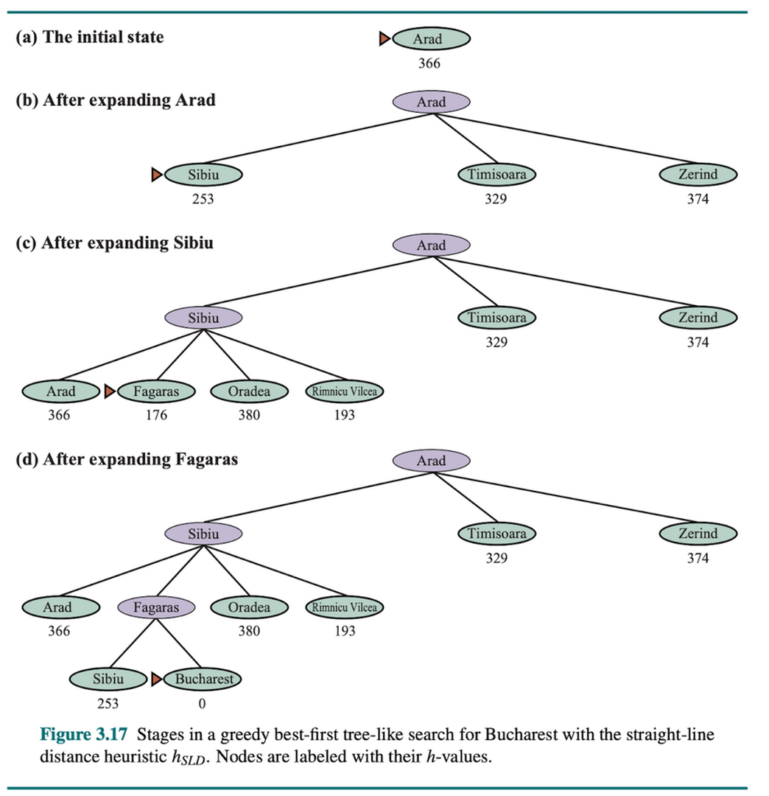
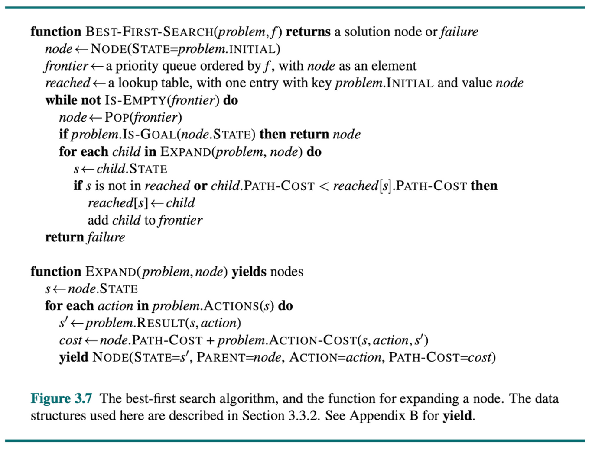
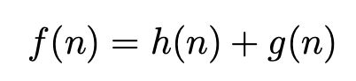
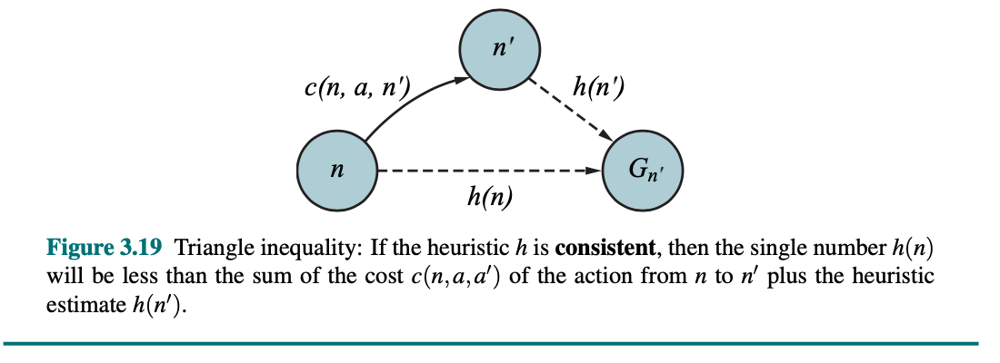
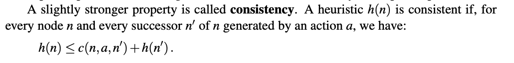
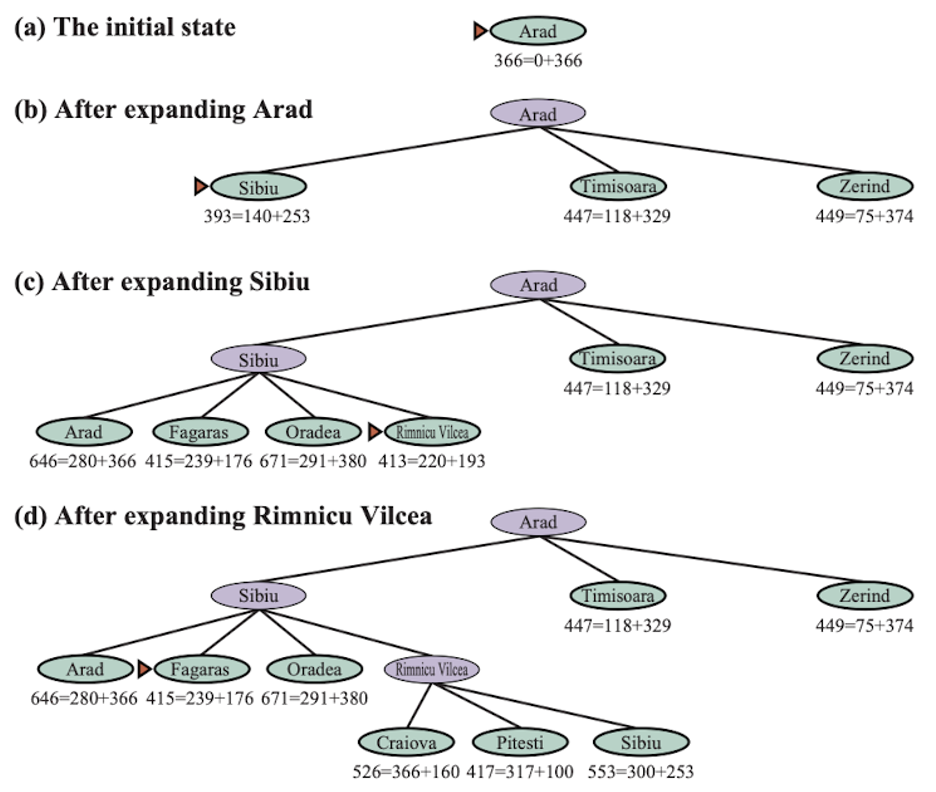

<!--
Week 4 Session A. Mini-lecture budget: 25 minutes.
Source: 02_Problem.pptx slides 11-16. Beats per lesson plan:
informed search (4) → A* (6) → PROPERTIES OF HEURISTICS (10, the empty slide,
written out) → optimality proof (5). Lesson plan: ../../weeks/week-04.md
-->

# Heuristics and A*

## Buying tractability with domain knowledge

**CMP-4004** · Week 4

---

# Informed search

Unlike blind search, it uses **additional knowledge** about the problem to guide
exploration toward the goal.

That knowledge is encoded in a **heuristic function**:

- `h(n)` = estimated cost from node *n* to the goal
- `h(n) = 0` if *n* is the goal
- `h(n) ≥ 0` always

A heuristic **does not guarantee** the correct path — it is an estimate.
A good one **dramatically** reduces the nodes explored.

---

# Greedy best-first search

Always expands the node that *appears* closest to the goal, by `h(n)` alone.
**Frontier: priority queue on `h(n)`.**

It is **greedy** — locally optimal at each step, ignoring accumulated cost.

- **Complete** only when repeated states are controlled
- **Not optimal** — no guarantee of the lowest-cost path
- Can be trapped in bad paths when the heuristic is misleading

<!--
4 min for informed search + greedy. Draw a map where greedy walks confidently
into a dead end. The failure motivates the g term on the next slide, so show
the failure first.
-->

---

# A*

# `f(n) = g(n) + h(n)`

- `g(n)` — **actual** accumulated cost from the start to *n*
- `h(n)` — **estimated** lowest cost from *n* to the goal
- `f(n)` — estimated total cost of the path **through** *n*

Always expands the node with the lowest `f(n)`.
**Frontier: priority queue on `f(n)`.**

**The intuition in two words:** *g* is what you have spent, *h* is what you expect
to spend. Minimizing the sum balances **progress** against **promise**.

---

# A* — properties

- **Complete** — always finds a solution if one exists and `h` is admissible
- **Optimal** — guarantees the lowest-cost path if `h` is admissible/consistent
- **Space: O(bᵈ)** — it keeps every generated node in memory
- **Time** — depends entirely on the **quality of `h`**

Note what is conditional and what is not. Both headline guarantees have a
hypothesis attached, and the next slide is about that hypothesis.

<!--
6 min for the two A* slides. The space complexity is the practical killer and
students underrate it: A* on a hard instance dies of memory, not time.
-->

---

# Properties of Heuristics

<!--
==============================================================================
THIS IS THE SLIDE THAT IS EMPTY IN THE SOURCE DECK.
02_Problem.pptx slide 16 has the title "Properties of Heuristics" and no body.
It is written out over the next four slides and it is the 10-minute core of the
week. Do not compress it. Everything students need for Duel 1 and Checkpoint 1
is here.
==============================================================================
-->

### The four properties that matter

1. Admissibility
2. Consistency
3. Dominance
4. Effective branching factor

### …and the one idea that generates all heuristics

5. Relaxed problems

---

# 1 · Admissible

## Admissible

# `h(n) ≤ h*(n)`

Never **overestimates** the true remaining cost. ⟹ **A\* is optimal on trees.**

# 2 Consistent (monotone)

# `h(n) ≤ c(n, a, n′) + h(n′)`

The **triangle inequality** on the heuristic. ⟹ **A\* is optimal on graphs**
*with* an explored set.

**Consistency implies admissibility. Not conversely.**

<!--
Why does an underestimate work but an overestimate not? Get the intuition on the
board: OPTIMISM means you never prematurely dismiss the cheap path. A pessimistic
h can make A* ignore the route that was actually best.
-->

---

# 3 · Dominance

If `h₂(n) ≥ h₁(n)` for all *n*, and **both are admissible**, then h₂ **dominates**
h₁ — and A* with h₂ expands **no more nodes** than A* with h₁.

> ## A better heuristic is a strictly better one.
> ## More informed is never worse.

This is unusual and worth pausing on. Most engineering trade-offs are trade-offs.
This one is not: within admissibility, closer to `h*` is free.

---

# 4 · Effective branching factor `b*`

The branching factor *b* that a **uniform tree of depth d** would need in order to
contain the number of nodes A* actually expanded.

`N + 1 = 1 + b* + (b*)² + … + (b*)ᵈ`

The practical measure of heuristic quality. **Closer to 1 is better.**

| Heuristic on the 8-puzzle, d = 12 | `b*` (typical) |
|---|---|
| `h = 0` (i.e. UCS) | ~2.8 |
| Misplaced tiles | ~1.5 |
| Manhattan distance | **~1.3** |

Small changes in `b*` are enormous changes in work, because it is an exponent.

---

# 5 · Where heuristics come from: relaxed problems

## Every admissible heuristic is the *exact* solution to an easier problem.

| Heuristic | The relaxation it exactly solves |
|---|---|
| **Misplaced tiles** | a tile can teleport anywhere in one move |
| **Manhattan distance** | tiles can pass **through** each other |
| **Straight-line distance** | you can drive through buildings |

Drop a constraint → solve the easier problem exactly → that value can never
exceed the true cost → **admissible by construction**.

<!--
This is the single most generative idea in the unit. It tells students how to
INVENT heuristics rather than recall them, and it is the skill Duel 1 grades.
State the recipe explicitly: list your constraints, cross one out, solve what's
left. That is a heuristic.
-->

---

# A* optimality — the proof

**Claim.** With admissible `h`, A* returns an optimal solution.

**Suppose not.** A* returns suboptimal goal `G₂` while optimal `G` (cost `C*`)
exists.

1. When `G₂` was selected, some node `n` on the optimal path to `G` was on the
   frontier.
2. By admissibility: `f(n) = g(n) + h(n) ≤ g(n) + h*(n) = C*`
3. Since `G₂` is suboptimal: `f(G₂) = g(G₂) > C*`
4. Therefore `f(n) < f(G₂)` — so A* would have selected `n` **first**.

## Contradiction. ∎

<!--
5 min. Do this properly on the board. It is the only real proof in the course,
it shows students what the word "guarantee" means on scorecard axis 2, and
Checkpoint 1 asks for it.
-->

---

# Next: live coding — A* is a 10-line diff

Reuse week 3's `search`. Order the frontier by `f` instead of `g`.

Then run **four** heuristics on the same depth-16 instance:

| Heuristic | Expansions | Solution length | Optimal? |
|---|---|---|---|
| `h_zero` (= UCS) | ~50,000 | 16 | ✔ |
| `h_misplaced` | ~1,500 | 16 | ✔ |
| `h_manhattan` | ~200 | 16 | ✔ |
| `h_bad = 3 × manhattan` | **~40** | **20** | ✘ |

> **`h_bad` is the fastest and it is wrong.**
>
> You can always buy speed by giving up the guarantee — and if you do not measure
> solution quality, you will not notice.

**That sentence is the bridge to every LLM comparison in this course.**

<!--
This table is the whole lecture in one artifact. If time is short, cut the proof
sketch before cutting the table — but try hard to keep both.
DUEL 1 GOES LIVE THIS WEEK: ../../projects/duel-1-search.md
-->
